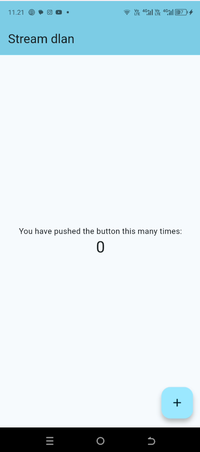
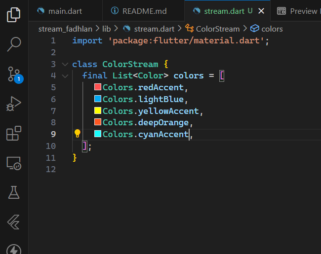
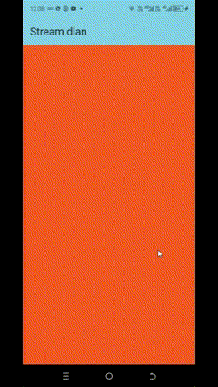
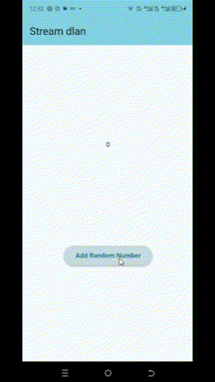
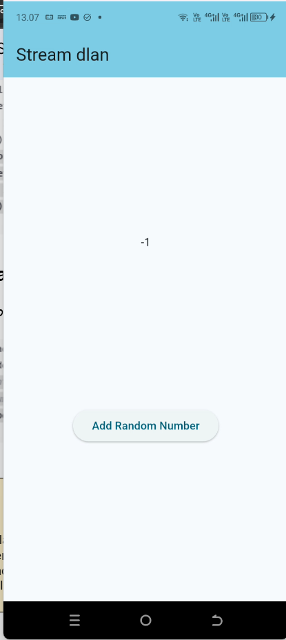

# stream_fadhlan

A new Flutter project.

## Getting Started

This project is a starting point for a Flutter application.

A few resources to get you started if this is your first Flutter project:

- [Lab: Write your first Flutter app](https://docs.flutter.dev/get-started/codelab)
- [Cookbook: Useful Flutter samples](https://docs.flutter.dev/cookbook)

For help getting started with Flutter development, view the
[online documentation](https://docs.flutter.dev/), which offers tutorials,
samples, guidance on mobile development, and a full API reference.

## Display
### **Praktikum 1**
#### <u>Soal 1</u>

#### <u>Soal 2</u>

#### <u>Soal 3</u>
- yield* merupakan delegating statement dalam konteks generator function. Secara singkat, fungsinya mirip seperti return, tetapi yield* meneruskan semua nilai dari generator lain, satu per satu, ke dalam aliran saat ini.
- Kode tersebut memerintahkan agar semua warna yang ada di dalam list diteruskan ke dalam stream satu per satu, dengan jeda 1 detik antar warna, secara berulang.

#### <u>Soal 4</u> 

#### <u>Soal 5</u>
- Tidak ada perbedaan signifikan dalam fungsionalitas jika menggunakan .listen() tanpa async, karena .listen() tidak perlu ditunggu hasilnya. Namun, jika kita menggunakan await, seperti pada await for, maka fungsi tersebut harus ditandai sebagai async. Ini karena await hanya bisa digunakan di dalam fungsi async.

-----
### **Praktikum 2**
#### <u>Soal 6</u>
- Langkah 8 (initState), untuk memuat data awal dari stream, mengatur koneksi stream, dan mendengarkan datanya agar UI bisa diperbarui setiap kali stream mengirim angka baru.
- Langka 10 (addRandomNumber), berfungsi untuk membuat angka random dengan batas maksimal 9, karena "random.nextInt(10)" menghasilkan angka dari 0 sampai kurang dari 10.

  

#### <u>Soal 7</u>
- Langkah 13 (addError),berfungsi untuk mengirimkan error ke dalam stream. Ketika dipanggil, stream akan men-trigger listener-nya untuk menangani error tersebut melalui onError. Fungsi ini tidak berfungsi sebagai validator input, tetapi sebagai mekanisme pelaporan error dalam sistem stream.
- Langkah 15 (Edit Method addRandomNumber), agar error bisa berfungsi maka perlu di uji dengan komentari 2 baris addNumberRandom

   

-----

