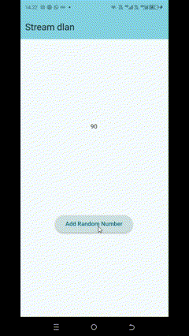
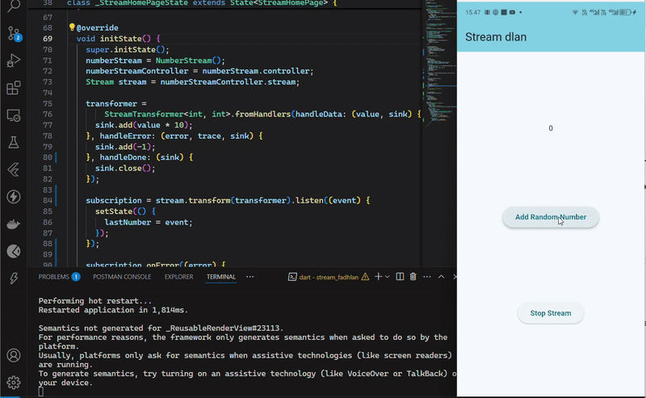
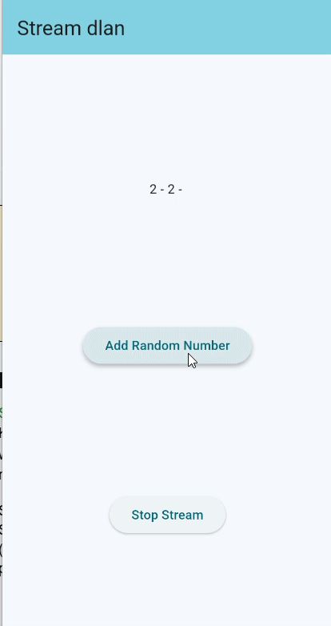

# stream_fadhlan

A new Flutter project.

## Getting Started

This project is a starting point for a Flutter application.

A few resources to get you started if this is your first Flutter project:

- [Lab: Write your first Flutter app](https://docs.flutter.dev/get-started/codelab)
- [Cookbook: Useful Flutter samples](https://docs.flutter.dev/cookbook)

For help getting started with Flutter development, view the
[online documentation](https://docs.flutter.dev/), which offers tutorials,
samples, guidance on mobile development, and a full API reference.

## Display
### **Praktikum 1**
#### <u>Soal 1</u>

#### <u>Soal 2</u>

#### <u>Soal 3</u>
- yield* merupakan delegating statement dalam konteks generator function. Secara singkat, fungsinya mirip seperti return, tetapi yield* meneruskan semua nilai dari generator lain, satu per satu, ke dalam aliran saat ini.
- Kode tersebut memerintahkan agar semua warna yang ada di dalam list diteruskan ke dalam stream satu per satu, dengan jeda 1 detik antar warna, secara berulang.

#### <u>Soal 4</u> 

#### <u>Soal 5</u>
- Tidak ada perbedaan signifikan dalam fungsionalitas jika menggunakan .listen() tanpa async, karena .listen() tidak perlu ditunggu hasilnya. Namun, jika kita menggunakan await, seperti pada await for, maka fungsi tersebut harus ditandai sebagai async. Ini karena await hanya bisa digunakan di dalam fungsi async.

-----
### **Praktikum 2**
#### <u>Soal 6</u>
- Langkah 8 (initState), untuk memuat data awal dari stream, mengatur koneksi stream, dan mendengarkan datanya agar UI bisa diperbarui setiap kali stream mengirim angka baru.
- Langka 10 (addRandomNumber), berfungsi untuk membuat angka random dengan batas maksimal 9, karena "random.nextInt(10)" menghasilkan angka dari 0 sampai kurang dari 10.

  

#### <u>Soal 7</u>
- Langkah 13 (addError),berfungsi untuk mengirimkan error ke dalam stream. Ketika dipanggil, stream akan men-trigger listener-nya untuk menangani error tersebut melalui onError. Fungsi ini tidak berfungsi sebagai validator input, tetapi sebagai mekanisme pelaporan error dalam sistem stream.
- Langkah 15 (Edit Method addRandomNumber), agar error bisa berfungsi maka perlu di uji dengan komentari 2 baris addNumberRandom

   

-----

### **Praktikum 3**
#### <u>Soal 8</u>  
- Langkah 1 (initialized StreamTransformer), berfungsi untuk menginisialisasi variabel sebelum dibuat struktur function kode nya.
- Langkah 2 (menambahkan variabel transformer => initState), berfungsi untuk memanipulasi data yg kemudian di ubah oleh "handleData", menangani eror "handleError", dan menutup sink saat stream selesai "handleDone".
- Langkah 3 (Edit stream), berfungsi sebagai listener agar data yg sebelumnya telah dimanipulasi bisa ditampilkan 
   
  

----

### **Praktikum 4**
#### <u>Soal 9</u>
- Langkah 2 (subscription),untuk melakukan langganan (subscription) terhadap stream, sekaligus memproses data yang masuk. Stream tersebut dimanipulasi menggunakan transformer, lalu hasil akhirnya akan didengarkan oleh listen(). Di dalam listen, setiap data yang masuk akan diolah dan ditampilkan ke UI melalui setState.
- Langkah 6 (dispose subscription.camcel), untuk menghentikan aliran data dan membersihkan sumber daya (resource) ketika widget sudah tidak aktif. numberStream.close() akan menutup StreamController, sedangkan subscription.cancel() akan menghentikan proses langganan terhadap stream. Ini penting untuk menghindari kebocoran memori (memory leak).
- Langkah 8 (edit addRandomNumber),  untuk menambahkan angka acak ke dalam stream. Jika StreamController masih terbuka (belum ditutup), maka angka akan dikirimkan ke stream. Namun, jika sudah ditutup, maka akan ditampilkan nilai -1 sebagai tanda bahwa data tidak bisa lagi dikirimkan.

  
  
----

### **Praktikum 5**
#### <u>Soal 10</u>
- Karena stream hanya bisa digunakan untuk 1 subscriptiom. Apabila ingin melakukan lebih dari 1 subsxription, maka perlu menggunakan broadcast Stream.

#### <u>Soal 11</u>
- Karena stream telah di define dengan propert BroadcastStream. sehingga data yg masuk dan ditampilkan menjadi 2 value (subscription dan subscription2)

    

----

### Praktikum 6
#### <u>Soal 12</u>

----

### **Praktikum 7**
#### <u>Soal 13</u>